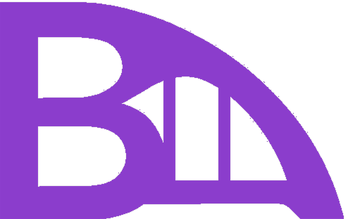

# 🏗️ Bridge - 포트폴리오 사이트

[https://bridge-vert.vercel.app/](https://bridge-vert.vercel.app/) 배포서버

 프론트엔드개발자 이성일의 포트폴리오입니다.

## 📋 프로젝트 소개

이 프로젝트는 Next.js와 TypeScript를 기반으로 제작된 개인 포트폴리오 웹사이트입니다.
프로젝트 경험, 기술 스택, 그리고 개인 소개를 담고 있습니다.

## 🚀 주요 기능

- **반응형 디자인**: 모든 디바이스에서 최적화된 사용자 경험
- **애니메이션 효과**: GSAP과 Framer Motion을 활용한 부드러운 애니메이션
- **프로젝트 갤러리**: 다양한 프로젝트들을 카테고리별로 분류하여展示
- **스킬 섹션**: 기술 스택을 시각적으로 표현
- **연락처 정보**: 소셜 미디어 및 연락처 링크

## 🛠️ 기술 스택

### Frontend

- **Next.js 15.3.3** - React 프레임워크
- **TypeScript** - 타입 안정성
- **Tailwind CSS** - 스타일링
- **GSAP** - 애니메이션 라이브러리
- **Framer Motion** - React 애니메이션

### Development Tools

- **Node.js** - 런타임 환경
- **PostCSS** - CSS 전처리
- **ESLint** - 코드 품질 관리

## 📁 프로젝트 구조

```
bridge/
├── public/           # 정적 파일 (이미지, 아이콘 등)
├── src/
│   ├── app/         # Next.js App Router
│   ├── components/  # React 컴포넌트
│   ├── data/        # 프로젝트 데이터
│   └── types/       # TypeScript 타입 정의
├── package.json
└── README.md
```

## 🚀 실행 방법

### 1. 저장소 클론

```bash
git clone [repository-url]
cd bridge
```

### 2. 의존성 설치

```bash
npm install
```

### 3. 개발 서버 실행

```bash
npm run dev
```

### 4. 브라우저에서 확인

[http://localhost:3000](http://localhost:3000)에서 결과를 확인할 수 있습니다.

## 📦 빌드 및 배포

### 프로덕션 빌드

```bash
npm run build
```

### 프로덕션 서버 실행

```bash
npm start
```

## 🎨 주요 프로젝트

이 포트폴리오에는 다음과 같은 프로젝트들이 포함되어 있습니다:

- **Rookie** - 야구 팬들을 위한 야구팬덤 사이트
- **EZSleep** - 수면 유도 UI/UX 프로젝트
- **Solid** - 코인 모의 투자 프로젝트
- **농담** - 못생긴 농작물 거래 사이트
- **Bridge** - 현재 포트폴리오 사이트

## 📞 연락처

- **GitHub**: [a01040579861]
- **이메일**: [a01040579861@gmail.com]

## 📄 라이선스

이 프로젝트는 개인 포트폴리오 목적으로 제작되었습니다.

---

**개발자**: 이성일  
**최종 업데이트**: 2025년 7월 6일
